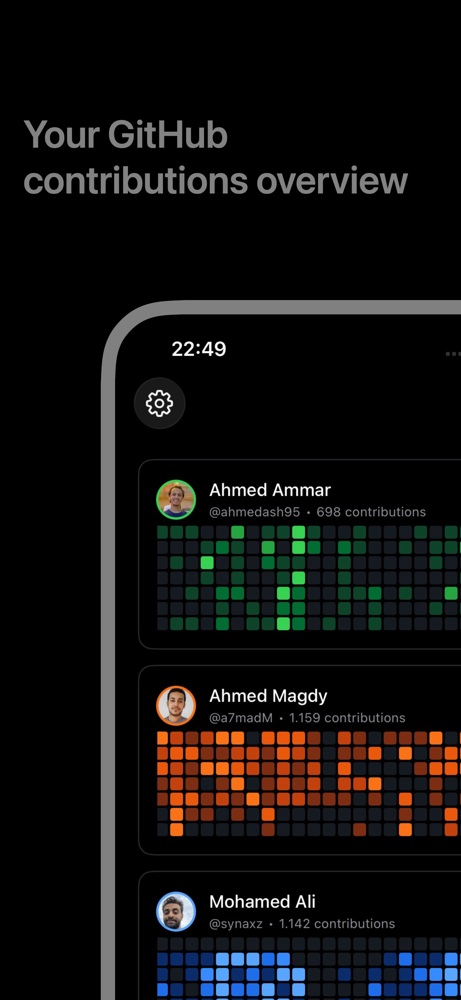
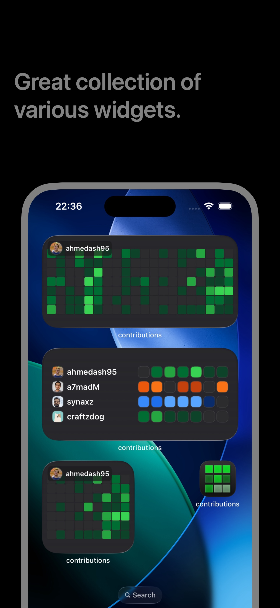
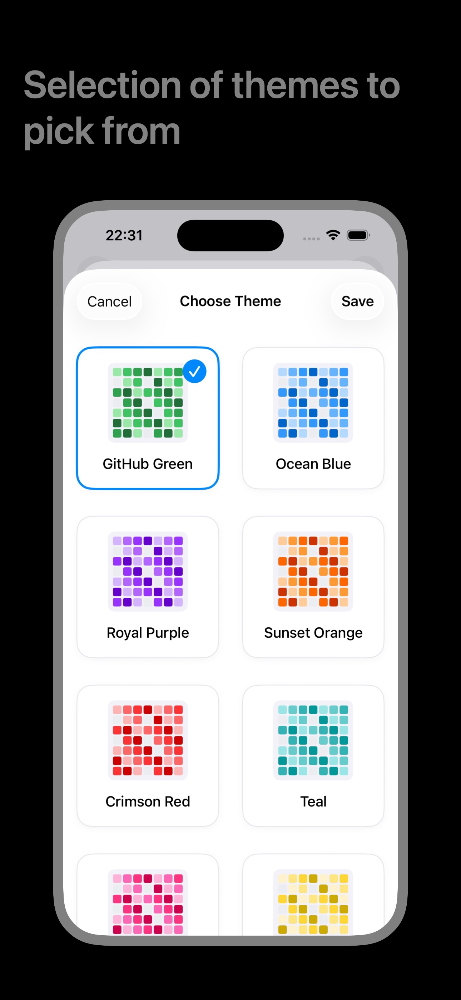

# GitHub Contributions iOS App & Widget

  

## Screenshots

|  |  |  |
| :-------------------------------------------------------------------------------------------------------: | :-------------------------------------------------------------------------------------------------------: | :-------------------------------------------------------------------------------------------------------: |
|                                               Main App View                                               |                                               Widgets View                                                |                                              Theme Selection                                              |

## Overview

A sleek iOS app that displays GitHub contribution graphs with customizable widgets. Built with SwiftUI and the GitHub API.

## Features

- **Contribution Charts**: View GitHub contribution graphs for any user
- **iOS Widgets**: Small and medium widgets for quick contribution viewing
- **User Management**: Add multiple GitHub users with custom color themes
- **Offline Support**: Cached data ensures widgets work without internet
- **Secure**: GitHub token stored securely in Keychain

## Setup

1. Add GitHub usernames in the app
2. Configure GitHub token for API access
3. Add widgets to your home screen
4. Select users to display in widgets

## Widget Configuration

- Long press widget → Edit Widget → Select user
- Widgets refresh automatically every hour
- Works offline using cached data

## Requirements

- iOS 17.0+
- GitHub account with personal access token
- App Groups capability configured for widget data sharing
